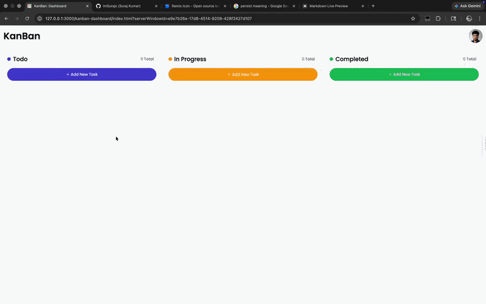

# 📌 Kanban Dashboard

<p align="center">
  
  
  
  
</p>

---

## 🎯 About the Project

A Kanban Dashboard built using Vanilla JavaScript to manage tasks visually.

This project was built with a **logic-first approach**, focusing on understanding how real-world systems work internally — including state management, DOM updates, and user interactions.

The goal was not just to build UI, but to train problem-solving and system thinking.

<p align="center">
  
</p>

---

## 🚀 Features

<p align="left">
  
  
  
  
  
</p>


## 🧠 Learning Focus

This project was intentionally built without relying on full solutions or copying code.

- Focused on **data structure design (array of objects for tasks)**
- Managed **state + UI synchronization manually**
- Implemented **drag & drop logic using browser events**
- Used **localStorage for persistence**
- Used AI only for UI/recall — not for core logic

<p align="left">
  
  
  
  
</p>


## ⚙️ Tech Stack

<p align="left">
  
  
  
</p>


## 🚀 Run Locally

```bash
git clone https://github.com/your-username/kanban-dashboard.git
cd kanban-dashboard
open index.html
```


## 🔥 Development Approach

<p>
  
  
  
  
</p>


## ⚠️ Limitations

- Drag-and-drop placement is basic (appends to container)
- UI updates are not fully optimized for large data
- No edit functionality (planned but not implemented)


## 🔮 Future Improvements

<p>
  
  
  
  
</p>


## 👨‍💻 Author

<p>
  
</p>